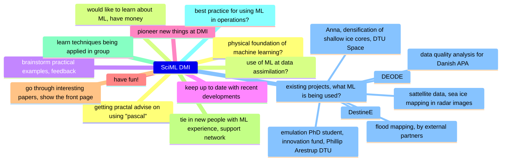

This was the first meetup of SciML @ DMI. Below are notes on what we discussed.
Feel free to make a pull-request to edit any inaccuracies - Leif Denby.

## What's new in ML?

- Nvidia modulus: [https://github.com/NVIDIA/modulus](https://github.com/NVIDIA/modulus)
  - non-standard loss function?
- `sketch` package: [https://github.com/approximatelabs/sketch](https://github.com/approximatelabs/sketch)
- noteable GPT+ plugin: [https://noteable.io/chatgpt-plugin-for-notebook/](https://noteable.io/chatgpt-plugin-for-notebook/)

## What do we want **SciML DMI** to be?

## GPUs?

- platform name, hardware available, cost, how to get access

- pascal.dmi.dk, 1x A100 80GB (paid for by IT during ASIP project, Tore Wulf) only available to ASIP group (Ask Tore Wulf twu@dmi.dk, Martin Koster mak@dmi.dk), cost ~ 100,000DKK
    - Tore Wulf: research group is pushing for more copies of pascal.dmi.dk
- ATOS @ ECMWF: should be easy to get access (KAH)
- European Weather Cloud
- LUMI
- EuroHPC: nvidia
- upcoming project needs:
    - Ruth: emulate regional climate model over two ice sheets - do we need more GPUs?
    - Fabrizio (EUMETNET project)
- no GPU UWC-W

## Research projects

- ASIP (Copernicus): sea ice mapping in radar images, convolutional neural networks, 
- ML (EumetSat fellowship): extending assimilation of sat microwave obs over seaice, fab@dmi.dk
- PRECISE: emulate regional climate (surface mass balance model) over ice-sheets, collab with Northumberland (sea-ice caverns) - rum@dmi.dk
- RopeWalk: digitising hand-written records of observations in ship-data tables - mas@dmi.dk
- ACCORD: use of machine learning in LAM NWP (data assimulation, ensemble forecasting and everything you can think of) - Henrik
- PhD:
   - TODO

## Background

- SciML Leeds community: [https://sciml-leeds.github.io](https://sciml-leeds.github.io)
